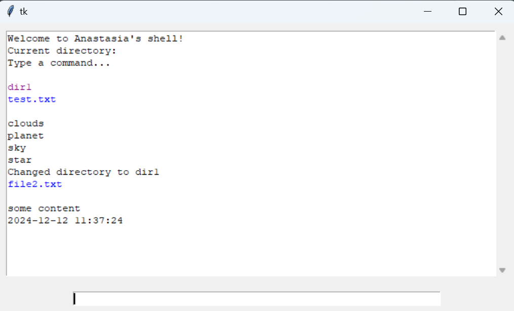

# Эмулятор оболочки с GUI и поддержкой TAR файловой системы

Этот проект представляет собой простой эмулятор оболочки с графическим интерфейсом (GUI) и поддержкой работы с файловой
системой, упакованной в TAR-архив. Программа включает команды `ls`, `cd`, `uniq`, `date` и `exit`. Она позволяет
взаимодействовать с виртуальной файловой системой внутри архива.

---

## Возможности

1. **`ls`**: Отображает содержимое каталогов в TAR-архиве.
2. **`cd`**: Меняет текущий каталог внутри TAR-архива.
3. **`uniq`**: Извлекает уникальные строки из текстового файла внутри TAR-архива.
4. **`date`**: Показывает текущую системную дату и время.
5. **`exit`**: Завершает работу эмулятора (включая GUI, если оно запущено).

---

## Настройка и требования

### Предварительные требования

- Python версии 3.10 или выше.
- Установленные библиотеки Python: `tkinter` (для GUI), `tarfile`, `unittest`.

### Установка

1. Клонируйте репозиторий:
   ```bash
   git clone https://github.com/BazylevaAA/konfig1
   cd konfig1
2. Как запустить
   В режиме командной строки
   Перейдите в папку проекта.
   Запустите эмулятор оболочки:

```bash
python main.py
```

3. Вводите команды интерактивно. Для выхода используйте exit.
   В режиме GUI
4. Запустите программу в режиме графического интерфейса:

```bash
python main.py
```

5. Взаимодействуйте через окно GUI.

### Описание команд

- **ls [путь]** - Отображает содержимое каталога в TAR-архиве.
- **cd [путь]** - Меняет текущий каталог в TAR-архиве.
- **uniq [файл]**    - Показывает уникальные строки из текстового файла.
- **date** - Показывает текущую системную дату и время.
- **exit**- Завершает работу эмулятора.

### Пример использования

Видео-обзор работы приложения доступен по ссылке https://youtu.be/vqUpaiM0yOk

### Результаты прогона тестов

